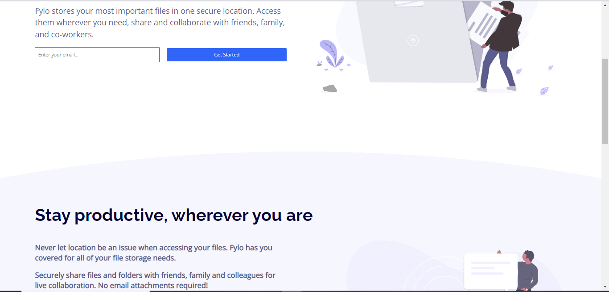

# Frontend Mentor - Fylo landing page with two-column layout

This is a solution to the [Fylo data storage component challenge on Frontend Mentor](https://www.frontendmentor.io/challenges/fylo-data-storage-component-1dZPRbV5n). It was done in an attempt to learn what contributing on a project as a group is about.

## Table of contents

- [Overview](#overview)
  - [The challenge](#the-challenge)
  - [Screenshot](#screenshot)
  - [Links](#links)
- [Our  process](#my-process)
  - [Built with](#built-with)
  - [What was learnt](#what-i-learned)
- [Contributors](#contributors)

## Overview

### The challenge

Users should be able to:

- View the optimal layout for the site depending on their device's screen size

### Screenshot

### Links

- Solution URL: [Solution Url](https://korede1004.github.io/Flyo_Project)
- Live Site URL: [Live Site](https://comforting-banoffee-84f366.netlify.app/)

## Our process

### Built with

- Semantic HTML5 markup
- CSS custom properties
- Flexbox
- CSS Grid
- Mobile-first workflow

### What was learnt
- We learnt about proper practices when more than one person is working on a project. 
- Our knowledge of flexbox and grid layouts was put to test.
- Some of us had our first attempt at using Mobile-first workflow.
- Practiced how to use css nesting.
- Ensured the use of aria-labels and semantic html to improve accessibility.

## Contributors

- Saheedat Afolabi - [Saheedat Afolabi](https://github.com/Saheedatt)
- Adekorede Aderigbigbe - [Adekorede Aderigbigbe](https://github.com/korede1004)

